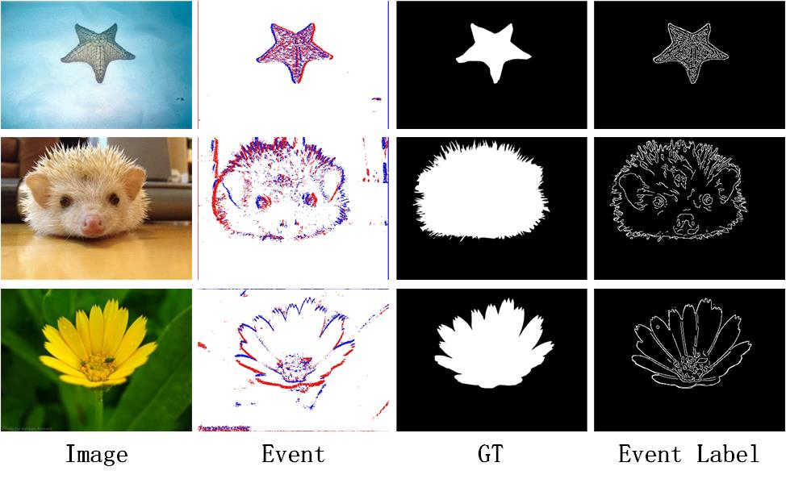
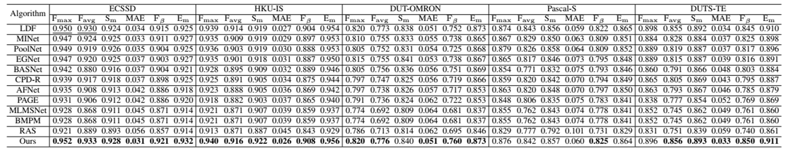
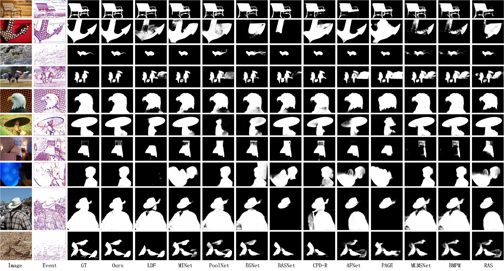

## [Learning-Event-Guided-Network-for-Salient-ObjectDetection]
by Xiurong Jiang, Lin Zhu, Hui Tian

## Introduction
   The pipeline of the proposed approach.
 
 

## Prerequisites
- [Python 3.5](https://www.python.org/)
- [Pytorch 1.3](http://pytorch.org/)
- [OpenCV 4.0](https://opencv.org/)
- [Numpy 1.15](https://numpy.org/)
- [TensorboardX](https://github.com/lanpa/tensorboardX)
- [Apex](https://github.com/NVIDIA/apex)

## Download dataset
Download the following datasets and unzip them into `data` folder

- [DUTS](http://saliencydetection.net/duts/)
- [DUT-OMRON](http://saliencydetection.net/dut-omron/)
- [ECSSD](http://www.cse.cuhk.edu.hk/leojia/projects/hsaliency/dataset.html)
- [HKU-IS](https://i.cs.hku.hk/~gbli/deep_saliency.html)
- [PASCAL-S](http://cbi.gatech.edu/salobj/)
- [DV](https://drive.google.com/drive/folders/14Tp9r_3wtR2GchHUWZHYV8SuEjkAxmiT?usp=sharing)

## Saliency maps & Trained model
- saliency maps: [Google](https://drive.google.com/drive/folders/1pShDP81zv-sSrgW9Jmfa5jrr0iLpdJLB?usp=sharing)
- trained model: [Google](https://drive.google.com/drive/folders/1oyVzw0mwSLVEXydtEQLAB5DvEu84gbHV?usp=sharing)
- Quantitative comparisons 

- Qualitative comparisons 

