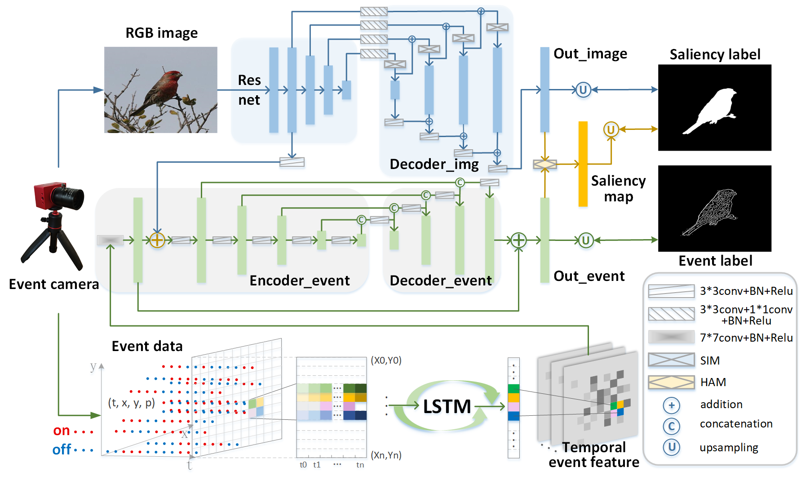

## [Learning-Event-Guided-Network-for-Salient-ObjectDetection]
by Xiurong Jiang, Lin Zhu, Hui Tian

## Introduction
 To get more accurate saliency maps, recent methods mainly focus on aggregating multi-level features from fully convolutional network (FCN) and introducing edge information as auxiliary supervision. Though remarkable progress has been achieved, we observe that the closer the pixel is to the edge, the more difficult it is to be predicted, because edge pixels have a very imbalance distribution. To address this problem, we propose a label decoupling framework (LDF) which consists of a label decoupling (LD) procedure and a feature interaction network (FIN). LD explicitly decomposes the original saliency map into body map and detail map, where body map concentrates on center areas of objects and detail map focuses on regions around edges. Detail map works better because it involves much more pixels than traditional edge supervision. Different from saliency map, body map discards edge pixels and only pays attention to center areas. This successfully avoids the distraction from edge pixels during training. Therefore, we employ two branches in FIN to deal with body map and detail map respectively. Feature interaction (FI) is designed to fuse the two complementary branches to predict the saliency map, which is then used to refine the two branches again. This iterative refinement is helpful for learning better representations and more precise saliency maps. Comprehensive experiments on six benchmark datasets demonstrate that LDF outperforms state-of-the-art approaches on different evaluation metrics.

## Prerequisites
- [Python 3.5](https://www.python.org/)
- [Pytorch 1.3](http://pytorch.org/)
- [OpenCV 4.0](https://opencv.org/)
- [Numpy 1.15](https://numpy.org/)
- [TensorboardX](https://github.com/lanpa/tensorboardX)
- [Apex](https://github.com/NVIDIA/apex)

## Download dataset
Download the following datasets and unzip them into `data` folder

- [DUTS](http://saliencydetection.net/duts/)
- [DUT-OMRON](http://saliencydetection.net/dut-omron/)
- [ECSSD](http://www.cse.cuhk.edu.hk/leojia/projects/hsaliency/dataset.html)
- [HKU-IS](https://i.cs.hku.hk/~gbli/deep_saliency.html)
- [PASCAL-S](http://cbi.gatech.edu/salobj/)
- [DV](https://drive.google.com/drive/my-drive)

## Saliency maps & Trained model
- saliency maps: [Google](https://drive.google.com/drive/my-drive)
- trained model: [Google](https://drive.google.com/drive/my-drive)
- Quantitative comparisons 

- Qualitative comparisons 

